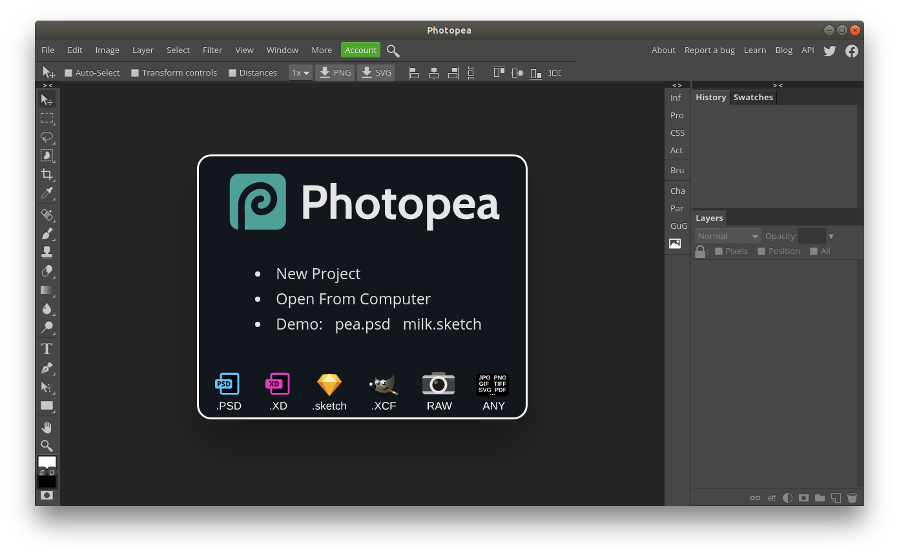

# Photopea Desktop app

🎨 Unofficial Electron app using webview for comfortable using from dock on desktop.

## Development

1. `git clone https://github.com/landsman/photopea-desktop.git`
2. `cd photopea-desktop`
3. `npm install`
4. `npm run start`

## Useful dev links
- https://www.christianengvall.se/electron-packager-tutorial/
- https://electron.atom.io/docs/tutorial/application-packaging/#generating-asar-archive
- https://iconverticons.com/online/
